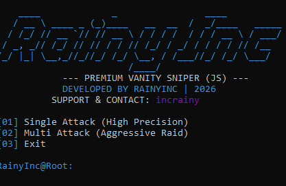

# RainyInc Ultimate Vanity Sniper v2.0
High-Performance WebSocket-Based Discord Vanity URL Sniper.
# (ücretsiz) PROJE ORTAKLIGI İCİN DİSCORD: incrainy 

---

## English Description

### Features
- WebSocket Integration: Built with discord.js-selfbot-v13 for real-time monitoring and low latency.
- Smart Error Reporting: Specifically identifies issues such as 2FA requirements, lack of permissions, or insufficient server boost levels.
- Dual Mode Execution: 
    - Single Precision: Focused monitoring with a single account.
    - Aggressive Multi-Mode: Simultaneous attempts using multiple tokens for maximum speed.
- Session Bypass: Optimized to handle Discord's session validation checks during URL claims.

### Installation
1. Install Node.js v16 or higher.
2. Navigate to the project directory.
3. Run the following command to install dependencies:
   npm install

### Usage
1. Open the terminal and start the application:
   node index.js
2. Select your desired mode from the menu.
3. Input the required Token, Guild ID, and Target Vanity URL.

### Requirements
- Target server must be Level 3 (minimum 14 boosts).
- The account used must have "Manage Server" permissions.
- If the server has a 2FA requirement for moderators, the account must have 2FA enabled.

### Legal Disclaimer and Responsibility
This software is provided for educational and research purposes only. Using self-bots is a direct violation of Discord's Terms of Service (ToS). By using this software, you acknowledge that:
- You are solely responsible for any consequences, including account suspensions or server bans.
- The developer (RainyInc) assumes no liability for any damages or losses resulting from the use or misuse of this software.
- Use at your own risk.

---

## Türkçe Açıklama

### Özellikler
- WebSocket Entegrasyonu: Gerçek zamanlı izleme ve düşük gecikme için discord.js-selfbot-v13 altyapısı kullanılmıştır.
- Akıllı Hata Raporlama: 401 hataları yerine; 2FA zorunluluğu, yetki eksikliği veya sunucu boost seviyesi gibi spesifik sorunları raporlar.
- Çift Mod Desteği:
    - Single Precision: Tek hesapla odaklanmış ve stabil izleme.
    - Aggressive Multi-Mode: Maksimum hız için birden fazla token ile eş zamanlı saldırı.
- Oturum Bypass: URL alımı sırasında Discord'un oturum doğrulama kontrollerini aşacak şekilde optimize edilmiştir.

### Kurulum
1. Node.js v16 veya daha yüksek bir sürüm yükleyin.
2. Proje klasörüne gidin.
3. Bağımlılıkları yüklemek için terminale şu komutu yazın:
   npm install

### Kullanım
1. Terminali açın ve uygulamayı başlatın:
   node index.js
2. Menüden kullanmak istediğiniz modu seçin.
3. Gerekli Token, Sunucu ID ve Hedef URL bilgilerini girin.

### Gereksinimler
- Hedef sunucunun Seviye 3 (en az 14 boost) olması şarttır.
- Kullanılan hesabın sunucuda "Sunucuyu Yönet" yetkisine sahip olması gerekir.
- Sunucuda 2FA (İki Aşamalı Doğrulama) zorunluluğu aktifse, hesabın 2FA koruması açık olmalıdır.

### Yasal Sorumluluk Reddi
Bu yazılım yalnızca eğitim ve araştırma amaçlı geliştirilmiştir. Self-bot kullanımı Discord Hizmet Şartları'nın (ToS) ihlali anlamına gelir. Bu yazılımı kullanarak aşağıdaki maddeleri kabul etmiş sayılırsınız:
- Hesap kapatılmaları veya sunucu yasaklamaları dahil olmak üzere tüm sonuçlardan yalnızca kullanıcı sorumludur.
- Geliştirici (RainyInc), yazılımın hatalı veya kötüye kullanımı sonucunda oluşabilecek hiçbir zarardan sorumlu tutulamaz.
- Tüm kullanım riski kullanıcıya aittir.

---

## Contact / İletişim
- Developer: RainyInc
- Discord: incrainy
